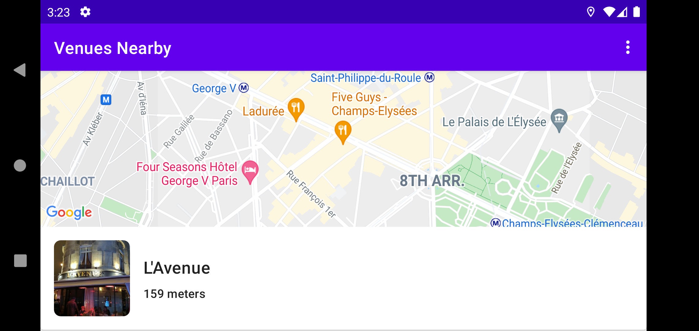

# Venues Nearby Android App

An Android app that shows nearby venues (restaurants) using the user's current location, and consumes Foursquare's API.

## Overview:

The app uses **MVVM** architecture with a Repository layer at the bottom for data retrieval and handling, Retrofit for Foursquare APIs and web services calling, Data and View Binding, Material Views, RxJava, a Foreground Location Service for providing location updates, and some other libraries.

The app is implemented mostly in **Kotlin**, with some Java classes to be converted and refactored later.

The app has two modes:

 - Single Update Mode:
   	- This mode subscribes to user's location only once on app startup, and retrieves venues list near the user.
 - Realtime Mode:
   	- This mode subscribes to the user's location and updates the venues list seamlessly if the user's location changes by a distance difference (500m) from the last updated one.

***

  

  

 

 

***

## Android Features and Libraries Used:

1. MVVM Architecture, Jetpack.
2. View Model, LiveData, etc.
3. RxJava.
4. Retrofit, Retrofit RxJava Adapter.
5. Google Maps, Location (Fused Location ProviderClient).
6. Data Binding and View Binding.
7. Glide.
8. Shapeable Image View.
9. Shimmer Layout.
10. Settings Activity and Shared Preferences.
